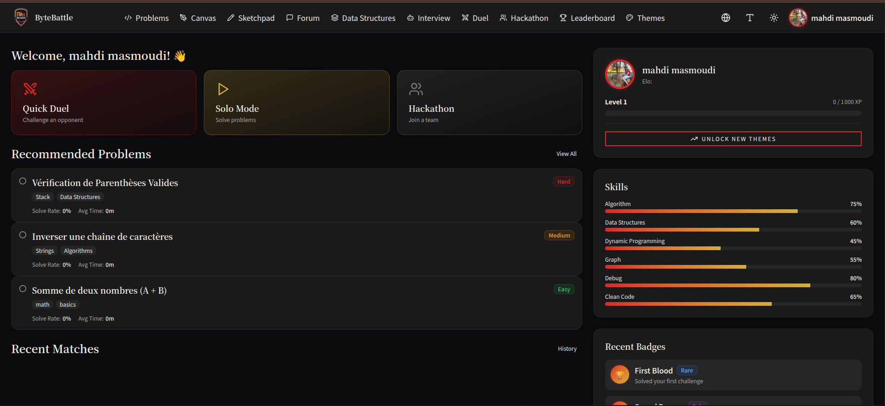

<div align="center">

# ⚔️ ByteBattle

### Competitive Programming Platform

[](https://nestjs.com/)
[](https://react.dev/)
[](https://mongodb.com/)
[](https://prisma.io/)
[](https://docker.com/)
[](https://typescriptlang.org/)

*A full-stack competitive programming platform featuring real-time 1v1 duels, hackathons, AI-assisted learning, and gamified progression.*

</div>

---

## 📋 Table of Contents

- [Features](#-features)
- [Architecture](#-architecture)
- [Tech Stack](#-tech-stack)
- [Project Structure](#-project-structure)
- [Getting Started](#-getting-started)
- [Environment Variables](#-environment-variables)
- [API Documentation](#-api-documentation)
- [Screenshots](#-screenshots)
- [Contributing](#-contributing)
- [License](#-license)

---

## ✨ Features

### 🎮 Core
| Feature | Description |
|---------|-------------|
| **Solo Mode** | Solve coding challenges with real-time code execution |
| **1v1 Duels** | Real-time competitive duels with ELO ranking system |
| **Hackathons** | Create and manage team-based hackathon competitions |
| **Leaderboard** | Global and per-language rankings |

### 🤖 AI-Powered
| Feature | Description |
|---------|-------------|
| **AI Hints** | Get contextual hints without spoiling the solution |
| **Code Review** | AI-powered code analysis and feedback |
| **Problem Generation** | Dynamically generate new challenges |

### 🎨 Gamification
| Feature | Description |
|---------|-------------|
| **XP & Levels** | Earn XP from solving problems and winning duels |
| **Themes** | Unlock visual themes as you level up |
| **Badges** | Earn achievement badges (First Blood, Speed Demon...) |
| **3D Avatar** | Customize your ReadyPlayerMe 3D avatar |

### 🏢 Enterprise
| Feature | Description |
|---------|-------------|
| **Technical Interviews** | Companies can create coding assessments |
| **Canvas Challenges** | Architecture/design challenges with visual editor |
| **Discussion Forum** | Community discussions with upvotes |

### 🔐 Admin
| Feature | Description |
|---------|-------------|
| **Dashboard** | Real-time platform analytics |
| **User Management** | Manage users, roles, bans |
| **Challenge CRUD** | Create, edit, publish challenges |
| **Hackathon Management** | Full lifecycle management (draft → archived) |

---

## 🏗 Architecture

```
┌─────────────┐     ┌──────────────┐     ┌──────────────┐
│   Frontend   │────▶│   Backend    │────▶│   MongoDB    │
│   React/TS   │     │   NestJS     │     │   (Prisma)   │
│   Port 3000  │     │   Port 4001  │     │   Port 27017 │
└─────────────┘     └──────┬───────┘     └──────────────┘
                           │
                    ┌──────▼───────┐     ┌──────────────┐
                    │   WebSocket  │     │ Judge Worker  │
                    │   Gateway    │     │   (Docker)    │
                    │  (Socket.IO) │     │   Port 4002   │
                    └──────────────┘     └──────────────┘
                                               │
                                    ┌──────────▼──────────┐
                                    │  Sandboxed Containers│
                                    │  Python/JS/C++/Java  │
                                    └─────────────────────┘
```
### Kubernetes Node Layout

The current Kubernetes deployment is designed around the following node layout:

```text
mahdi-masmoudi-vivobook-asuslaptop-x515ep-x515ep
├── Kubernetes Control Plane
├── Jenkins
├── Helm
├── Ingress Controller
└── kubectl admin

adam-vm
├── Frontend React
├── Backend NestJS
└── WebSocket Gateway

sabri-vm
├── Judge Worker
├── MongoDB
├── Redis
├── Prometheus
└── Grafana
```

---

## 🛠 Tech Stack

### Backend
- **Framework:** NestJS (Node.js)
- **Language:** TypeScript
- **Database:** MongoDB with Prisma ORM
- **Auth:** JWT + Google OAuth 2.0 (Passport.js)
- **Real-time:** Socket.IO (WebSocket gateway)
- **File Upload:** Multer
- **Validation:** class-validator / class-transformer
- **AI:** OpenAI API integration

### Frontend
- **Framework:** React 18 with TypeScript
- **Routing:** React Router v6
- **Styling:** Tailwind CSS with CSS variables (theming)
- **Code Editor:** Monaco Editor (VS Code engine)
- **3D Avatar:** ReadyPlayerMe integration
- **Icons:** Lucide React
- **HTTP:** Axios
- **Real-time:** Socket.IO Client

### Judge Worker
- **Runtime:** Node.js
- **Containerization:** Docker (sandboxed execution)
- **Supported Languages:** Python, JavaScript, TypeScript, C, C++, Java, Go, Rust

### DevOps
- **Package Manager:** pnpm
- **Database:** MongoDB (local or Atlas)
- **Containerization:** Docker & Docker Compose

---

## 📁 Project Structure

```
ByteBattle2-officiel/
├── backend/                    # NestJS API server
│   ├── prisma/
│   │   └── schema.prisma       # Database schema
│   ├── src/
│   │   ├── auth/               # JWT + Google OAuth
│   │   ├── users/              # User management
│   │   ├── challenges/         # Problem CRUD
│   │   ├── submissions/        # Code execution
│   │   ├── duels/              # 1v1 real-time duels
│   │   ├── hackathons/         # Hackathon management
│   │   ├── leaderboard/        # Rankings
│   │   ├── discussions/        # Forum
│   │   ├── ai/                 # AI hints & review
│   │   ├── canvas/             # Canvas challenges
│   │   ├── enterprise/         # Enterprise features
│   │   └── admin/              # Admin dashboard
│   └── package.json
│
├── frontend/                   # React SPA
│   ├── src/
│   │   ├── components/         # Reusable UI components
│   │   ├── pages/              # Page components
│   │   │   ├── admin/          # Admin pages
│   │   │   └── ...             # User-facing pages
│   │   ├── context/            # React contexts (Auth, Theme...)
│   │   ├── services/           # API service layer
│   │   ├── hooks/              # Custom React hooks
│   │   ├── data/               # Models & types
│   │   └── routes.tsx          # Route definitions
│   └── package.json
│
├── judge-worker/               # Code execution microservice
│   ├── prisma/
│   │   └── schema.prisma
│   ├── src/
│   │   └── index.ts            # Docker-based code runner
│   └── package.json
│
├── .gitignore
└── README.md
```

---

## 🚀 Getting Started

### Prerequisites

- **Node.js** ≥ 18
- **pnpm** (recommended) or npm
- **MongoDB** (local instance or [MongoDB Atlas](https://www.mongodb.com/atlas))
- **Docker** (for judge-worker code execution)

### 1. Clone the repository

```bash
git clone https://github.com/YOUR_USERNAME/ByteBattle2-officiel.git
cd ByteBattle2-officiel
```

### 2. Install dependencies

```bash
# Backend
cd backend
pnpm install

# Frontend
cd ../frontend
pnpm install

# Judge Worker
cd ../judge-worker
pnpm install
```

### 3. Configure environment variables

```bash
# Backend
cp backend/.env.example backend/.env
# Edit backend/.env with your values (see Environment Variables section)

# Frontend (optional)
cp frontend/.env.example frontend/.env
```

### 4. Setup the database

```bash
cd backend
npx prisma generate
npx prisma db push
```

### 5. Start the services

```bash
# Terminal 1 — Backend
cd backend
pnpm run start:dev

# Terminal 2 — Frontend
cd frontend
pnpm run dev

# Terminal 3 — Judge Worker
cd judge-worker
pnpm run start:dev
```

### 6. Open the app

```
Frontend:     http://localhost:3000
Backend API:  http://localhost:4001/api
Judge Worker: http://localhost:4002
```

---

## 🔐 Environment Variables

### Backend (`backend/.env`)

```env
# Database
DATABASE_URL="mongodb://localhost:27017/bytebattle"

# JWT
JWT_SECRET="your-super-secret-jwt-key"
JWT_REFRESH_SECRET="your-refresh-secret-key"

# Google OAuth
GOOGLE_CLIENT_ID="your-google-client-id"
GOOGLE_CLIENT_SECRET="your-google-client-secret"
GOOGLE_CALLBACK_URL="http://localhost:4001/api/auth/google/callback"

# Gemini AI (for AI features)
GEMINI_API_KEY="your-google-gemini-api-key"

# Judge Worker
JUDGE_WORKER_URL="http://localhost:4002"

# Server
PORT=4001
FRONTEND_URL="http://localhost:3000"
```

---

## 🤖 Gemini AI Prompts

The platform uses **Google Gemini AI** for multiple features. Here are the prompts used for AI-powered functionality:

### 1. Code Review Prompt

**Purpose:** Analyze submitted code and provide detailed feedback

**Location:** `backend/src/ai/ai.service.ts` → `buildReviewPrompt()`

**Prompt Structure:**
```
Tu es un expert en revue de code et un ingénieur senior. Analyse le code suivant et fournis une revue détaillée et constructive.

**Challenge:** [Challenge Title]
**Description du problème:** [Challenge Description]
**Langage:** [Programming Language]
**Code soumis:** [User Code]

**Instructions:**
Fournis une revue de code structurée au format JSON strict avec les champs suivants:
- score (0-100)
- strengths (3-5 positive points)
- improvements (3-5 areas for improvement)
- bugs (potential bugs, empty if none)
- suggestions (3-5 refactoring suggestions)
- complexity ("low" | "medium" | "high")
- readability (0-100)
- bestPractices (0-100)
- summary (2-3 sentence summary)

**Critères d'évaluation:**
1. Correction - Le code résout-il correctement le problème ?
2. Lisibilité - Code clair, bien nommé, bien structuré ?
3. Performance - Complexité algorithmique optimale ?
4. Bonnes pratiques - Respect des conventions
5. Robustesse - Gestion des cas limites et erreurs
6. Maintenabilité - Facilité de modification future
```

**Models Used:** `gemini-2.0-flash`, `gemini-2.5-flash`, `gemini-2.0-flash-lite`

---

### 2. Challenge Draft Generation Prompt

**Purpose:** Generate new coding challenges automatically

**Location:** `backend/src/ai/ai.service.ts` → `buildChallengeDraftPrompt()`

**Prompt Structure:**
```
Tu es un expert en conception de challenges de programmation. Crée un brouillon de challenge de code clair, original et réalisable en 1 à 2 heures, en respectant cette demande:

[User Prompt]

Retourne uniquement du JSON valide sans explication supplémentaire. Le JSON doit contenir les champs suivants:
{
  "title": "...",
  "difficulty": "easy|medium|hard",
  "tags": ["tag1", "tag2"],
  "category": "algorithms|data structures|math|strings|graphs|dynamic programming|other",
  "statementMd": "Description du problème en markdown",
  "allowedLanguages": ["javascript", "python", "java"],
  "tests": [{"input": "...", "expectedOutput": "...", "isHidden": false}],
  "hints": ["Hint 1", "Hint 2"]
}
```

---

### 3. Canvas Challenge Draft Prompt

**Purpose:** Generate visual/architecture design challenges

**Location:** `backend/src/ai/ai.service.ts` → `buildCanvasChallengeDraftPrompt()`

**Prompt Structure:**
```
Tu es un expert en conception de challenges Canvas/UX. Crée un brouillon de challenge Canvas clair, original et réalisable en 1 à 2 heures.

Retourne uniquement du JSON valide avec:
{
  "title": "...",
  "difficulty": "easy|medium|hard",
  "category": "frontend|ux|dataflow|integration|security|product|general",
  "briefMd": "Description du challenge en markdown",
  "deliverables": "Liste des livrables attendus",
  "rubric": {"criteria": "...", "points": "..."},
  "assets": ["asset1.png", "asset2.svg"],
  "hints": ["Hint 1", "Hint 2"],
  "excalidrawElements": [/* Excalidraw elements array */]
}
```

---

### 4. Interview Initial Prompt

**Purpose:** Start technical interviews with domain-specific expertise

**Location:** `backend/src/ai/ai-interview.service.ts` → `generateInitialPrompt()`

**Prompt Components:**

**System Prompt includes:**
- Domain-specific persona (Cloud Architect, Backend Engineer, etc.)
- Interview level (easy, medium, hard)
- Sub-topics to cover
- Evaluation criteria (3-5 domain-specific skills)
- Reference questions for the level
- Behavior rules (guidance, hints, scaffolding)

**Initial User Prompt:**
```
Tu es un interviewer technique. Présente-toi selon le persona fourni, puis pose ta première question adaptée au niveau **[difficulty]** sur le domaine de **[domain]**.
```

---

### 5. Interview Conversation Prompt

**Purpose:** Continue technical interviews with context awareness

**Location:** `backend/src/ai/ai-interview.service.ts` → `generateResponse()`

**Includes:**
- Full conversation history (last 10 messages)
- Domain system prompt
- Current user message
- Guidance to ask follow-up questions and provide hints

---

### 6. Code Review During Interview Prompt

**Purpose:** Review code submissions during interviews

**Location:** `backend/src/ai/ai-interview.service.ts` → `reviewCode()`

**Prompt Structure:**
```
[Conversation Context]

**Code soumis (${language}):**
[Submitted Code]

Analyse ce code dans le contexte d'un entretien de niveau **[difficulty]** sur **[domain]**.

Fournis un feedback structuré:
1. **Correction ✅/❌** - Le code résout-il le problème ?
2. **Complexité** - Big-O temporel et spatial
3. **Qualité** - Lisibilité, bonnes pratiques, nommage
4. **Edge cases** - Cas limites gérés ou manquants
5. **Améliorations** - 3-5 suggestions concrètes
```

---

### 7. Interview Final Feedback Prompt

**Purpose:** Generate comprehensive interview evaluation

**Location:** `backend/src/ai/ai-interview.service.ts` → `generateFinalFeedback()`

**Prompt Structure:**
```
L'entretien de niveau **[difficulty]** sur **[domain]** vient de se terminer.

[Full Conversation History]

**Critères d'évaluation pour ce domaine:**
[Evaluation Criteria List]

Génère un feedback final détaillé au format JSON avec:
{
  "overallScore": <0-10>,
  "technicalScore": <0-10>,
  "communicationScore": <0-10>,
  "problemSolvingScore": <0-10>,
  "verdict": "HIRE" | "MAYBE" | "NO_HIRE",
  "competencyScores": [{"competency": "...", "score": <0-10>, "feedback": "..."}],
  "strengths": [3-5 strengths],
  "improvements": [3-5 improvements],
  "recommendedResources": [{"title": "...", "url": "...", "type": "course|article|practice"}],
  "closingMessage": "personalized message"
}
```

---

### 8. Domain-Specific Interview Configurations

The platform supports **8 specialized interview domains** with custom personas and evaluation criteria:

| Domain | Persona | Sub-Topics | Evaluation Criteria |
|--------|---------|-----------|-------------------|
| **Cloud Computing** | Senior Cloud Architect (10+ yrs) | EC2, Lambda, S3, VPC, IAM, Auto-scaling, Serverless | System Design, Cloud Knowledge, Scalability, Security, Cost Awareness |
| **Backend Engineering** | Senior Backend Engineer | APIs, Databases, Caching, Message Queues, Microservices | API Design, Database Design, Scalability, Code Quality |
| **Frontend Engineering** | Senior Frontend Engineer | React, TypeScript, Performance, Accessibility, UX | Component Design, State Management, Performance, Accessibility |
| **Software Engineering** | Tech Lead / Architect | OOP, Design Patterns, Refactoring, Testing | Problem Solving, Code Quality, Architecture, Testing |
| **Cybersecurity** | Security Engineer | Encryption, Authentication, Vulnerabilities, Compliance | Security Mindset, Threat Modeling, Best Practices |
| **Data Science & AI** | ML Engineer | ML Algorithms, Feature Engineering, Model Evaluation | ML Fundamentals, Data Analysis, Experimentation |
| **DevOps/SRE** | DevOps Engineer | CI/CD, Infrastructure, Monitoring, Incident Management | System Design, Automation, Reliability, Troubleshooting |
| **Mobile Development** | Mobile Engineer | React Native, iOS/Android, Performance, User Experience | Mobile Architecture, Performance, UX Design |

Each domain has:
- **Easy/Medium/Hard** question sets
- Language support (FR/EN)
- Domain-specific evaluation criteria
- Persona-driven interviewer style

---

### Configuration & Generation

**Models Used:**
- Code Review: `gemini-2.0-flash`, `gemini-2.5-flash`, `gemini-2.0-flash-lite`
- Interviews: `gemini-2.5-flash`

**Generation Config:**
```typescript
generationConfig: {
  temperature: 0.7-0.8,    // Balanced creativity and consistency
  topP: 0.95,              // Diverse response selection
  topK: 40,                // Limit response diversity
  maxOutputTokens: 2048-8192  // Depends on feature
  responseMimeType: "application/json"  // For structured output
}
```

**Retry Strategy:**
- Up to 3 models with fallback
- Exponential backoff for rate-limited requests
- Automatic retry for HTTP 429/503 errors

---

## 📡 API Documentation

### Authentication
| Method | Endpoint | Description |
|--------|----------|-------------|
| `POST` | `/api/auth/register` | Register a new user |
| `POST` | `/api/auth/login` | Login with email/password |
| `GET` | `/api/auth/google` | Google OAuth login |
| `GET` | `/api/auth/me` | Get current user profile |
| `POST` | `/api/auth/refresh` | Refresh access token |

### Challenges
| Method | Endpoint | Description |
|--------|----------|-------------|
| `GET` | `/api/challenges` | List all challenges |
| `GET` | `/api/challenges/:id` | Get challenge details |
| `POST` | `/api/challenges` | Create challenge (admin) |
| `PATCH` | `/api/challenges/:id` | Update challenge (admin) |

### Submissions
| Method | Endpoint | Description |
|--------|----------|-------------|
| `POST` | `/api/submissions` | Submit code for evaluation |
| `GET` | `/api/submissions/my` | Get my submissions |

### Duels
| Method | Endpoint | Description |
|--------|----------|-------------|
| `POST` | `/api/duels/queue` | Join matchmaking queue |
| `GET` | `/api/duels/:id` | Get duel details |
| `GET` | `/api/duels/leaderboard` | Get duel rankings |

### Hackathons
| Method | Endpoint | Description |
|--------|----------|-------------|
| `GET` | `/api/hackathons` | List hackathons |
| `POST` | `/api/hackathons` | Create hackathon (admin) |
| `PATCH` | `/api/hackathons/:id` | Update hackathon |
| `POST` | `/api/hackathons/:id/join` | Join a hackathon |

### Leaderboard
| Method | Endpoint | Description |
|--------|----------|-------------|
| `GET` | `/api/leaderboard` | Global leaderboard |
| `GET` | `/api/leaderboard/language/:lang` | Per-language ranking |

---

## 📸 Screenshots

> *Add screenshots of your application here*

| Dashboard | Duel Arena | Hackathon |
|-----------|-----------|-----------|
|  |  |  |

---

## 🤝 Contributing

1. Fork the repository
2. Create your feature branch (`git checkout -b feature/amazing-feature`)
3. Commit your changes (`git commit -m 'Add amazing feature'`)
4. Push to the branch (`git push origin feature/amazing-feature`)
5. Open a Pull Request

---

## 📄 License

This project is licensed under the MIT License — see the [LICENSE](LICENSE) file for details.

---

<div align="center">

**Built with ❤️ by the ByteBattle Team**

⚔️ *Code. Compete. Conquer.* ⚔️

</div>
