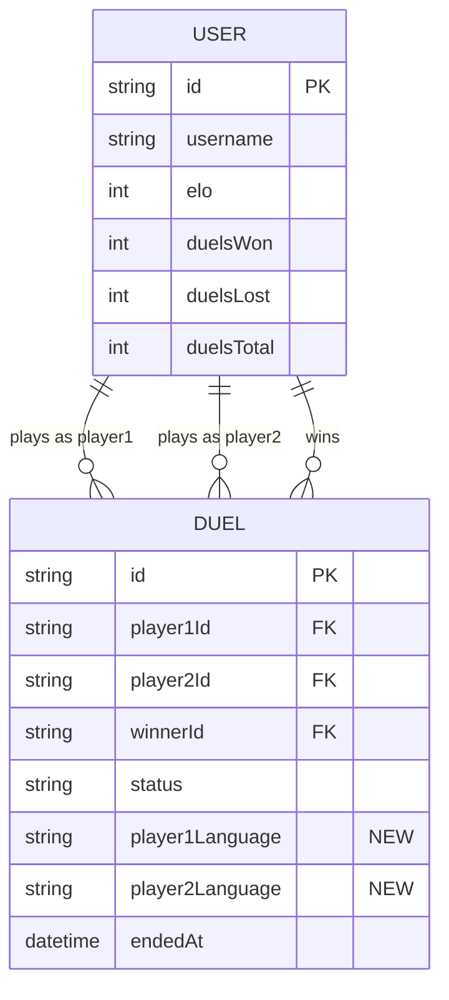

# Data Model: Fix & Configure Leaderboard

## Existing Entities (Modified)

### User (unchanged)

Relevant fields for leaderboard:

| Field | Type | Default | Description |
|-------|------|---------|-------------|
| `id` | String (ObjectId) | auto | Primary key |
| `username` | String | — | Unique display name |
| `profileImage` | String? | null | Avatar URL |
| `elo` | Int | 1200 | ELO rating |
| `xp` | Int | 0 | Experience points |
| `level` | Int | 1 | Player level |
| `duelsWon` | Int | 0 | Total duels won |
| `duelsLost` | Int | 0 | Total duels lost |
| `duelsTotal` | Int | 0 | Total duels played |
| `status` | UserStatus | active | Account status |

**Computed fields** (not stored):
- `winRate`: `(duelsWon / (duelsWon + duelsLost)) * 100` — computed at query time

### Duel (MODIFIED)

Two new fields added to persist programming language:

| Field | Type | Default | Description | Status |
|-------|------|---------|-------------|--------|
| `player1Language` | String? | null | Language used by player 1 | **NEW** |
| `player2Language` | String? | null | Language used by player 2 | **NEW** |

All other existing fields remain unchanged. See
[schema.prisma](file:///home/mahdi-masmoudi/Bureau/ByteBattle2-officiel/backend/prisma/schema.prisma#L383-L426)
for the full model.

**Data flow**: When `endDuel()` is called, the DuelPlayerState from Redis contains the
`language` field (set during `testCode()`). These values are persisted to the Duel
document alongside scores and timing data.

## Relationships for Leaderboard Queries



## Query Patterns

### Global Leaderboard (default)
```
User.findMany({ where: { status: 'active' }, select: { ..., duelsWon, duelsLost, duelsTotal } })
→ Map to add computed winRate
→ Sort by elo (default), xp, level, or winRate
```

### Language-Filtered Leaderboard
```
Step 1: Duel.findMany({ where: { status: 'completed', OR: [{ player1Language: lang }, { player2Language: lang }] } })
→ Aggregate by userId: count wins, count losses per language
Step 2: User.findMany({ where: { id: { in: userIds } } })
→ Merge with per-language stats
→ Sort by per-language winRate
```

### Available Languages
```
Duel.findMany({ where: { status: 'completed', player1Language: { not: null } }, distinct: ['player1Language'] })
UNION
Duel.findMany({ where: { status: 'completed', player2Language: { not: null } }, distinct: ['player2Language'] })
→ Deduplicate → Sort alphabetically
```
