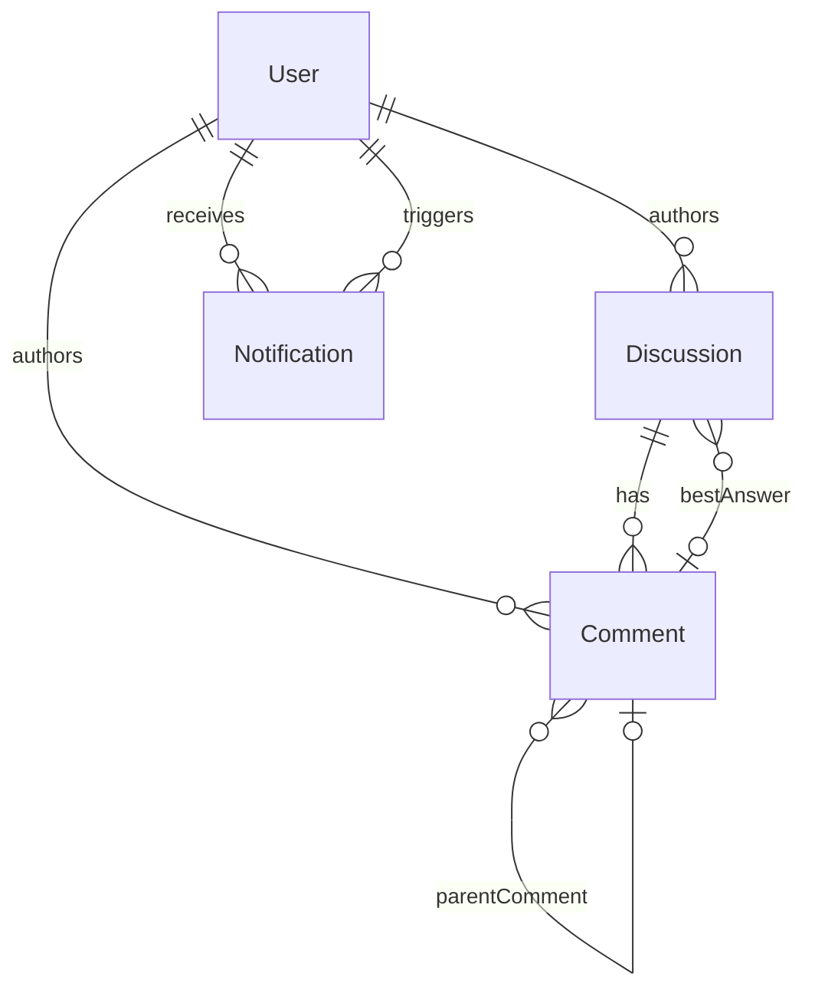

# Data Model: Discussion Forum

**Date**: 2026-03-25  
**Feature**: 004-discussion-forum

## Entities

### Discussion

| Field | Type | Notes |
|-------|------|-------|
| id | ObjectId | PK, auto-generated |
| title | String | Max 200 chars |
| content | String | Max 10,000 chars, rich text |
| category | String | Default: "general". One of: general, help, algorithms, challenge, showcase, feedback |
| authorId | ObjectId | FK → User |
| tags | String[] | 1-5 tags |
| challengeId | ObjectId? | Optional, links to a Challenge |
| upvotes | ObjectId[] | User IDs who upvoted |
| downvotes | ObjectId[] | User IDs who downvoted |
| commentCount | Int | Denormalized counter, default 0 |
| views | Int | Incremented on detail page load, default 0 |
| isSolved | Boolean | Default false, toggled by author |
| bestAnswerCommentId | ObjectId? | FK → Comment, set by author |
| flags | ObjectId[] | User IDs who reported |
| isHidden | Boolean | Auto-set true when flags.length >= 5 |
| createdAt | DateTime | Auto |
| updatedAt | DateTime | Auto |

**Indexes**: `[tags]`, `[category]`, `[createdAt DESC]`

### Comment

| Field | Type | Notes |
|-------|------|-------|
| id | ObjectId | PK |
| content | String | Comment text |
| authorId | ObjectId | FK → User |
| discussionId | ObjectId | FK → Discussion |
| parentCommentId | ObjectId? | FK → Comment (for nesting, max depth 2) |
| upvotes | ObjectId[] | User IDs who upvoted |
| downvotes | ObjectId[] | User IDs who downvoted |
| isBestAnswer | Boolean | Default false, toggled by post author |
| flags | ObjectId[] | User IDs who reported |
| isHidden | Boolean | Auto-set true when flags.length >= 5 |
| createdAt | DateTime | Auto |
| updatedAt | DateTime | Auto |

**Indexes**: `[discussionId]`

### Notification

| Field | Type | Notes |
|-------|------|-------|
| id | ObjectId | PK |
| recipientId | ObjectId | FK → User (who receives) |
| actorId | ObjectId | FK → User (who triggered) |
| type | String | "like-post", "like-comment", "new-comment", "reply-comment", "best-answer" |
| targetId | ObjectId | Discussion or Comment ID |
| targetType | String | "discussion" or "comment" |
| isRead | Boolean | Default false |
| createdAt | DateTime | Auto |

**Indexes**: `[recipientId, createdAt DESC]`, `[recipientId, isRead]`  
**Retention**: Max 100 per user, oldest auto-deleted.

## Relationships



## State Transitions

### Discussion Lifecycle

```
Created → [Edit] → Updated
Created → [Mark Solved] → Solved
Created → [Flagged >= 5] → Hidden
Created → [Delete] → Deleted (+ cascade comments)
```

### Comment Lifecycle

```
Created → [Edit] → Updated  
Created → [Mark Best Answer] → BestAnswer
Created → [Flagged >= 5] → Hidden
Created → [Delete] → Deleted (+ cascade replies)
```
