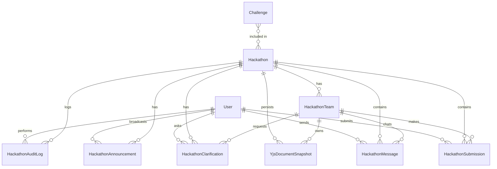

# Data Model: Hackathon System

**Date**: 2026-03-29 (updated)  
**Feature**: 009-hackathon-system

## Important: HackathonTeam ≠ Team

The existing `Team` model is **NOT modified**. It keeps its `session` and `analytics` fields for backward compatibility. A **new** `HackathonTeam` model is created with no relation to `Team`. Hackathon teams are created and managed independently.

## Entities

### Hackathon (MODIFY existing)

| Field | Type | Notes |
|-------|------|-------|
| id | ObjectId | PK, auto-generated |
| title | String | Max 200 chars |
| description | String? | Short description for listing cards |
| startTime | DateTime | Competition start |
| endTime | DateTime | Competition end |
| status | HackathonStatus | Extended enum (see below) |
| freezeAt | DateTime? | When scoreboard freezes |
| challengeIds | ObjectId[] | FK → Challenge, ordered (A, B, C…) |
| rulesMd | String? | Markdown rules document |
| scope | String | "public" / "enterprise" / "invite-only" |
| companyId | ObjectId? | FK → Company (enterprise scope) |
| joinCode | String? | 6-char alphanumeric invite code |
| teamPolicy | Json | `{ minSize: 1, maxSize: 3, autoAssign: false }` |
| bannerUrl | String? | Banner image URL |
| cancelledReason | String? | Reason for cancellation (if cancelled) |
| createdById | ObjectId | FK → User (admin who created) |
| createdAt | DateTime | Auto |
| updatedAt | DateTime | Auto |

**Indexes**: `[status]`, `[createdAt DESC]`, `[joinCode]`

**Enterprise rule**: If `scope = "enterprise"` + `companyId` is set → `teamPolicy` is forced to `{ minSize: 1, maxSize: 1 }` and max 1 team allowed.

### HackathonStatus Enum (MODIFY existing)

```
draft | lobby | checkin | active | frozen | ended | archived | cancelled
```

**New values**: `lobby`, `checkin`, `archived`, `cancelled`

### Team (EXISTING — NOT MODIFIED)

The existing `Team` model is left as-is with `session` and `analytics` fields. It is used by other parts of the system. **Do not touch.**

### HackathonTeam (NEW — separate from Team)

| Field | Type | Notes |
|-------|------|-------|
| id | ObjectId | PK |
| hackathonId | ObjectId | FK → Hackathon |
| name | String | Team display name, max 50 chars |
| members | HackathonTeamMember[] | Embedded array |
| joinCode | String | 6-char alphanumeric team invite code |
| isCheckedIn | Boolean | Default false, set by captain during checkin |
| isDisqualified | Boolean | Default false, set by admin |
| solvedCount | Int | Denormalized, default 0 |
| penaltyTime | Int | Total penalty in minutes, default 0 |
| score | Int | Computed score (solvedCount primary, penaltyTime secondary) |
| type | String | "open" / "enterprise" |
| companyId | ObjectId? | FK → Company |
| createdAt | DateTime | Auto |

**Indexes**: `[hackathonId]`, `[hackathonId, solvedCount DESC, penaltyTime ASC]`

### HackathonTeamMember (NEW embedded type — separate from TeamMember)

| Field | Type | Notes |
|-------|------|-------|
| userId | ObjectId | FK → User |
| role | String | "captain" / "member" |
| joinedAt | DateTime | When they joined the team |

**Captain succession rule**: If captain leaves, oldest member by `joinedAt` is auto-promoted. If no members remain, team is dissolved.

### YjsDocumentSnapshot (NEW)

| Field | Type | Notes |
|-------|------|-------|
| id | ObjectId | PK |
| hackathonId | ObjectId | FK → Hackathon |
| teamId | ObjectId | FK → HackathonTeam |
| challengeId | ObjectId | FK → Challenge |
| snapshot | Bytes | Yjs document binary snapshot |
| updatedAt | DateTime | Auto (last persistence time) |

**Indexes**: `[hackathonId, teamId, challengeId]` (unique compound)  
**Persistence**: Updated every 30 seconds from in-memory Yjs document.

### HackathonSubmission (NEW)

| Field | Type | Notes |
|-------|------|-------|
| id | ObjectId | PK |
| hackathonId | ObjectId | FK → Hackathon |
| teamId | ObjectId | FK → Team |
| challengeId | ObjectId | FK → Challenge |
| userId | ObjectId | FK → User (who submitted) |
| code | String | Source code |
| language | String | "javascript" / "python" / "cpp" |
| verdict | String | "queued" / "AC" / "WA" / "TLE" / "RE" / "CE" |
| testsPassed | Int? | Number of tests passed |
| testsTotal | Int? | Total test cases |
| timeMs | Float? | Execution time |
| memMb | Float? | Memory used |
| attemptNumber | Int | 1-based attempt counter for this team+problem |
| penaltyMinutes | Int | Computed penalty if this is the AC submission |
| isFirstBlood | Boolean | Default false, set to true if first AC for this challenge |
| jobId | String? | BullMQ job ID |
| submittedAt | DateTime | Auto |

**Indexes**: `[hackathonId, teamId, challengeId]`, `[hackathonId, challengeId, verdict]`, `[hackathonId, submittedAt DESC]`

### HackathonMessage (NEW)

| Field | Type | Notes |
|-------|------|-------|
| id | ObjectId | PK |
| hackathonId | ObjectId | FK → Hackathon |
| teamId | ObjectId | FK → Team |
| userId | ObjectId | FK → User (sender) |
| content | String | Message text, max 2000 chars |
| codeSnippet | String? | Optional code block |
| codeLanguage | String? | Language for syntax highlighting |
| sentAt | DateTime | Auto |

**Indexes**: `[hackathonId, teamId, sentAt]`

### HackathonAnnouncement (NEW)

| Field | Type | Notes |
|-------|------|-------|
| id | ObjectId | PK |
| hackathonId | ObjectId | FK → Hackathon |
| adminId | ObjectId | FK → User (admin who posted) |
| content | String | Announcement text, max 5000 chars |
| isPinned | Boolean | Default false |
| createdAt | DateTime | Auto |

**Indexes**: `[hackathonId, createdAt DESC]`

### HackathonClarification (NEW)

| Field | Type | Notes |
|-------|------|-------|
| id | ObjectId | PK |
| hackathonId | ObjectId | FK → Hackathon |
| teamId | ObjectId | FK → Team (requesting team) |
| userId | ObjectId | FK → User (who asked) |
| challengeId | ObjectId? | Null = "general" |
| question | String | Max 2000 chars |
| answer | String? | Admin response |
| answeredById | ObjectId? | FK → User (admin who answered) |
| status | String | "pending" / "answered" / "no-response" |
| isBroadcast | Boolean | Default false, if true all teams see it |
| createdAt | DateTime | Auto |
| answeredAt | DateTime? | When admin responded |

**Indexes**: `[hackathonId, status]`, `[hackathonId, teamId]`

### HackathonAuditLog (NEW)

| Field | Type | Notes |
|-------|------|-------|
| id | ObjectId | PK |
| hackathonId | ObjectId | FK → Hackathon |
| actorId | ObjectId | FK → User (admin who acted) |
| action | String | "lifecycle_change" / "rejudge" / "disqualify" / "reinstate" / "announcement" / "clarification_response" / "team_modify" |
| details | Json? | Action-specific payload |
| createdAt | DateTime | Auto |

**Indexes**: `[hackathonId, createdAt DESC]`, `[hackathonId, action]`

## Relationships



**NOTE**: `Team` (existing model) is NOT in this diagram. `HackathonTeam` is a separate, independent model.

## State Transitions

### Hackathon Lifecycle

```
draft ─── "Publish" ───────────→ lobby
lobby ─── "Unpublish" ─────────→ draft     (only if 0 teams registered)
lobby ─── auto 30min before ───→ checkin    (or manual "Start Check-in")
checkin ─ auto at startTime ───→ active     (or manual "Start Now", requires ≥1 checked-in team)
active ── auto at freezeAt ────→ frozen     (or manual "Freeze Now")
active ── manual "End Now" ────→ ended
frozen ── auto at endTime ─────→ ended      (or manual "End Now")
ended ─── "Archive" ───────────→ archived

Cancellation:
  draft ──────→ [hard delete from DB]
  lobby ──────→ cancelled  (soft delete, notify participants, type name to confirm)
  checkin ────→ cancelled  (soft delete, notify participants, extra warning)
  active ─────→ ❌ FORBIDDEN (must End Now first)
  frozen ─────→ ❌ FORBIDDEN (must End Now first)
  ended ──────→ archived   (soft delete, results preserved, read-only)
```

### Submission Lifecycle

```
queued ──→ judging ──→ AC (accepted)
                    ──→ WA (wrong answer)
                    ──→ TLE (time limit exceeded)
                    ──→ RE (runtime error)
                    ──→ CE (compilation error)
```

### Clarification Lifecycle

```
pending ──→ answered (with response text)
        ──→ no-response (dismissed by admin)
```

### Team Lifecycle

```
registered ──→ checked-in ──→ competing ──→ finished
                                        ──→ disqualified
```

## ICPC Scoring Formula

```
For each team:
  solved = count of problems with at least one AC verdict
  penalty = Σ (for each solved problem):
              time_of_AC_in_minutes + (wrong_attempts × 20)

Ranking:
  1. Sort by solved DESC
  2. Tiebreak by penalty ASC
  3. Tiebreak by earliest last-solve time ASC
```

## Prisma Schema Changes

### Modified Enum

```prisma
enum HackathonStatus {
  draft
  lobby
  checkin
  active
  frozen
  ended
  archived
  cancelled
}
```

### Modified Hackathon Model

```prisma
model Hackathon {
  id              String          @id @default(auto()) @map("_id") @db.ObjectId
  title           String
  description     String?
  startTime       DateTime
  endTime         DateTime
  status          HackathonStatus @default(draft)
  freezeAt        DateTime?
  challengeIds    String[]        @db.ObjectId
  rulesMd         String?
  scope           String          // "public" | "enterprise" | "invite-only"
  companyId       String?         @db.ObjectId
  joinCode        String?
  teamPolicy      Json?           // { minSize, maxSize, autoAssign }
  bannerUrl       String?
  cancelledReason String?         // Reason for cancellation
  createdById     String          @db.ObjectId

  teams          HackathonTeam[]
  submissions    HackathonSubmission[]
  messages       HackathonMessage[]
  announcements  HackathonAnnouncement[]
  clarifications HackathonClarification[]
  auditLogs      HackathonAuditLog[]
  yjsSnapshots   YjsDocumentSnapshot[]

  createdAt DateTime @default(now())
  updatedAt DateTime @updatedAt

  @@index([status])
  @@index([joinCode])
}
```

### Existing Team Model — NOT MODIFIED

```prisma
// ⚠️ DO NOT TOUCH — kept for backward compatibility
// The existing Team model stays as-is with session, analytics fields
// HackathonTeam is a SEPARATE model
model Team {
  // ... existing fields unchanged ...
}
```

### NEW HackathonTeam Model (separate from Team)

```prisma
model HackathonTeam {
  id              String                @id @default(auto()) @map("_id") @db.ObjectId
  hackathonId     String                @db.ObjectId
  hackathon       Hackathon             @relation(fields: [hackathonId], references: [id])
  name            String
  members         HackathonTeamMember[]
  joinCode        String
  isCheckedIn     Boolean               @default(false)
  isDisqualified  Boolean               @default(false)
  solvedCount     Int                   @default(0)
  penaltyTime     Int                   @default(0)
  score           Int                   @default(0)
  type            String                // "open" | "enterprise"
  companyId       String?               @db.ObjectId
  createdAt       DateTime              @default(now())

  submissions    HackathonSubmission[]
  messages       HackathonMessage[]
  clarifications HackathonClarification[]
  yjsSnapshots   YjsDocumentSnapshot[]

  @@index([hackathonId])
}
```

### NEW HackathonTeamMember Embedded Type (separate from TeamMember)

```prisma
type HackathonTeamMember {
  userId   String   @db.ObjectId
  role     String   // "captain" | "member"
  joinedAt DateTime @default(now())
}
```

### New Models

```prisma
model HackathonSubmission {
  id             String        @id @default(auto()) @map("_id") @db.ObjectId
  hackathonId    String        @db.ObjectId
  hackathon      Hackathon     @relation(fields: [hackathonId], references: [id])
  teamId         String        @db.ObjectId
  team           HackathonTeam @relation(fields: [teamId], references: [id])
  challengeId    String        @db.ObjectId
  userId         String        @db.ObjectId
  code           String
  language       String
  verdict        String        @default("queued")
  testsPassed    Int?
  testsTotal     Int?
  timeMs         Float?
  memMb          Float?
  attemptNumber  Int
  penaltyMinutes Int           @default(0)
  isFirstBlood   Boolean       @default(false)
  jobId          String?
  submittedAt    DateTime      @default(now())

  @@index([hackathonId, teamId, challengeId])
  @@index([hackathonId, challengeId, verdict])
  @@index([hackathonId, submittedAt(sort: Desc)])
}

model HackathonMessage {
  id           String        @id @default(auto()) @map("_id") @db.ObjectId
  hackathonId  String        @db.ObjectId
  hackathon    Hackathon     @relation(fields: [hackathonId], references: [id])
  teamId       String        @db.ObjectId
  team         HackathonTeam @relation(fields: [teamId], references: [id])
  userId       String        @db.ObjectId
  content      String
  codeSnippet  String?
  codeLanguage String?
  sentAt       DateTime      @default(now())

  @@index([hackathonId, teamId, sentAt])
}

model HackathonAnnouncement {
  id          String    @id @default(auto()) @map("_id") @db.ObjectId
  hackathonId String    @db.ObjectId
  hackathon   Hackathon @relation(fields: [hackathonId], references: [id])
  adminId     String    @db.ObjectId
  content     String
  isPinned    Boolean   @default(false)
  createdAt   DateTime  @default(now())

  @@index([hackathonId, createdAt(sort: Desc)])
}

model HackathonClarification {
  id           String        @id @default(auto()) @map("_id") @db.ObjectId
  hackathonId  String        @db.ObjectId
  hackathon    Hackathon     @relation(fields: [hackathonId], references: [id])
  teamId       String        @db.ObjectId
  team         HackathonTeam @relation(fields: [teamId], references: [id])
  userId       String        @db.ObjectId
  challengeId  String?       @db.ObjectId
  question     String
  answer       String?
  answeredById String?       @db.ObjectId
  status       String        @default("pending")
  isBroadcast  Boolean       @default(false)
  createdAt    DateTime      @default(now())
  answeredAt   DateTime?

  @@index([hackathonId, status])
  @@index([hackathonId, teamId])
}

model HackathonAuditLog {
  id          String    @id @default(auto()) @map("_id") @db.ObjectId
  hackathonId String    @db.ObjectId
  hackathon   Hackathon @relation(fields: [hackathonId], references: [id])
  actorId     String    @db.ObjectId
  action      String
  details     Json?
  createdAt   DateTime  @default(now())

  @@index([hackathonId, createdAt(sort: Desc)])
  @@index([hackathonId, action])
}

model YjsDocumentSnapshot {
  id          String        @id @default(auto()) @map("_id") @db.ObjectId
  hackathonId String        @db.ObjectId
  hackathon   Hackathon     @relation(fields: [hackathonId], references: [id])
  teamId      String        @db.ObjectId
  team        HackathonTeam @relation(fields: [teamId], references: [id])
  challengeId String        @db.ObjectId
  snapshot    Bytes
  updatedAt   DateTime      @updatedAt

  @@unique([hackathonId, teamId, challengeId])
}
```
